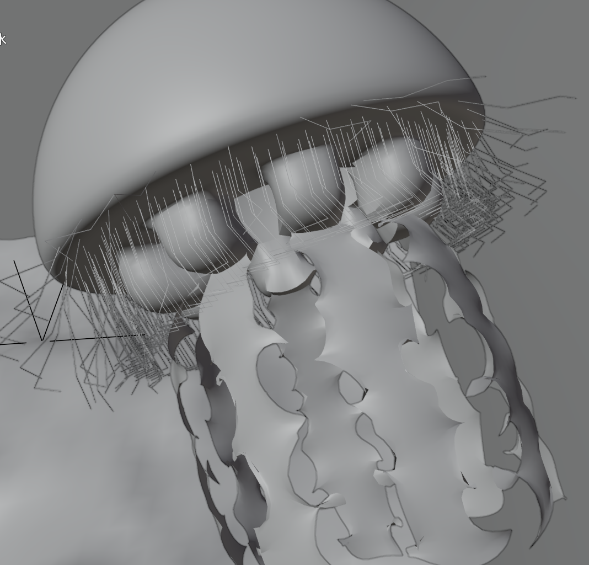

# Procedural Jellyfish

## Overview
This project explores **procedural modeling** and **simulation** techniques in Houdini by creating animated jellyfish from scratch. The model is built entirely using geometry nodes and procedural workflows, making it flexible, customizable, and fully animation-ready.

The final scene includes multiple procedural jellyfish instances placed across a simulated ocean floor. One central jellyfish is encased inside a transparent, faceted geometry resembling a crystal. The surrounding environment includes imported coral meshes, a sand-like ground plane, and a volumetric lighting setup to simulate underwater depth and scattering. Light caustics and reflections are used to enhance surface detail, and the water surface is represented using a displaced plane with animated normals. Each jellyfish includes key anatomical features such as the **bell**, **arms**, **veins**, **organs**, and **tentacles**—all crafted procedurally and animated to simulate natural underwater movement.

  
  
  

---

## Features

### Bell and Arms
The bell was modeled using radial symmetry and animated with sine-based deformations to replicate natural pulsing. Arms were instanced beneath the bell and deformed using the **Point Deform** node to match the bell's motion organically.

### Veins
Veins were generated using the **Find Shortest Path** node to create organic, branching patterns across the jellyfish body.

**Process:**
- Remeshed the bell into triangles to improve vein layout.
- Applied the shortest path algorithm to extract vein curves.
- Used **Smooth**, **Resample**, **Fuse**, and **Sweep** nodes for refinement and thickness.
- Deformed veins alongside the bell using **Point Deform**.

### Organs
The organs were created using basic geometry primitives combined with noise-based deformations and copy-to-points workflows. They were placed inside the bell using a scatter-and-align setup, and animated with slight noise offsets to simulate motion.

### Tentacles
Tentacles were generated using curves and simulated with Houdini's wire dynamics system. The setup includes a hair generation network with constraints at the root and motion driven by turbulence forces. The simulation was cached using a File Cache node for playback and rendering.

### Stones, Corals, and Environment Elements
Stone meshes and background elements were imported from external sources to enrich the final scene and give context to the jellyfish’s movement.

---

## Tools & References

- Houdini Geometry Nodes
- [SideFX SOP Node Docs](https://www.sidefx.com/docs/houdini/nodes/sop/index.html)
- [SideFX VEX Functions](https://www.sidefx.com/docs/houdini/vex/functions/index.html)
- [File Cache Node Tutorial](https://www.youtube.com/watch?v=00s9YWDWFs0)
- [Simulation Caching Debugging](https://www.youtube.com/watch?v=jwIuzB9FkX0)
- [Jellyfish Bell Tutorial](https://www.youtube.com/watch?v=J3X8BB0yNRE)
- [Jellyfish Arms Tutorial](https://www.youtube.com/watch?v=A_oNXqx8XH4)
- [Tentacle Simulation Reference](https://www.youtube.com/watch?v=LN4XXaHQkmU)
